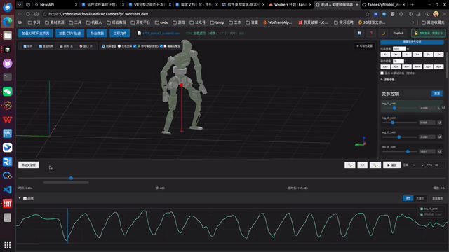
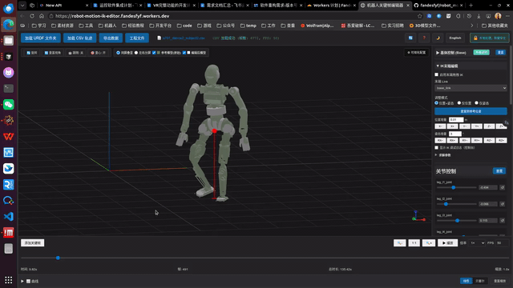
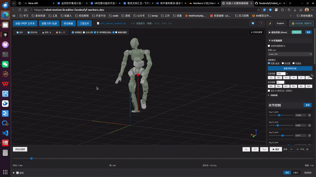

# Robot Keyframe Editor

This project is an improved fork of **[cyoahs/robot_motion_editor](https://github.com/cyoahs/robot_motion_editor)** — a browser-based keyframe motion editor.

A browser-based robot motion trajectory editor with URDF loading, CSV editing, dual-viewport comparison, inverse kinematics (IK) end-effector editing, and project persistence.

**中文:** [README.md](README.md)

## Live Demo

**[robot-motion-ik-editor.fandesfyf.workers.dev](https://robot-motion-ik-editor.fandesfyf.workers.dev/)**

## Demonstrations

Screen recordings embedded as GIF for inline preview on GitHub and in Markdown viewers.

### IK End-Effector Editing

Drag the end-effector in the 3D viewport, adjust pose, and write keyframes with configurable solver parameters.



### Joint Editing

Edit joint trajectories via the sidebar and curve panel with keyframe management.



### Viewport & Visualization

Configure ghost reference model, overlay/split layout, and playback rate.



## Privacy

All processing runs locally in the browser. No data is uploaded to a server.

## Features

- Residual keyframes on CSV base trajectories; linear / Bezier interpolation
- Keyframe clipboard, drag-to-move, keyboard shortcuts
- Drag-and-drop URDF folders and CSV files
- Viewport overlay/split with ghost reference model
- IK end-effector editing via `closed-chain-ik`
- On-demand curve plots with legend; timeline sync
- Project save/load, auto-save, COM visualization, EN/ZH UI

## Changes vs. Upstream

Forked from [cyoahs/robot_motion_editor](https://github.com/cyoahs/robot_motion_editor).

| Item | Details |
|------|---------|
| Baseline | [`48ee549`](https://github.com/cyoahs/robot_motion_editor/commit/48ee549e25042c9d4859139ef4ddb03f7b332701) (2026-05-12) |
| Last updated | 2026-06-03 |
| Live demo | [robot-motion-ik-editor.fandesfyf.workers.dev](https://robot-motion-ik-editor.fandesfyf.workers.dev/) |

```bash
git log 48ee549e25042c9d4859139ef4ddb03f7b332701..HEAD --oneline
```

See [README.md](README.md) for the full changelog (Chinese).

## Quick Start

```bash
npm install
npm run dev
npm run build
```

See [DEVELOPMENT.md](DEVELOPMENT.md) and [USAGE.md](USAGE.md).

## License

MIT
