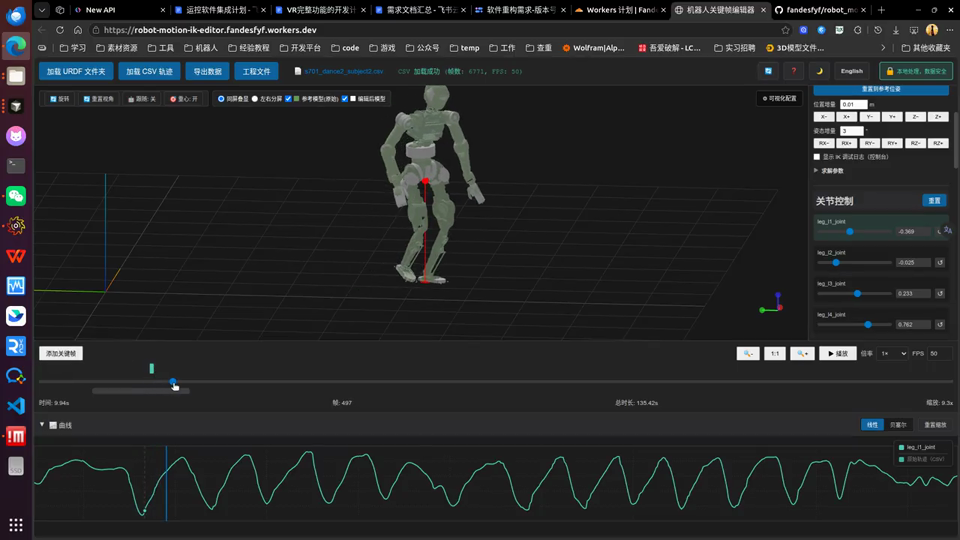
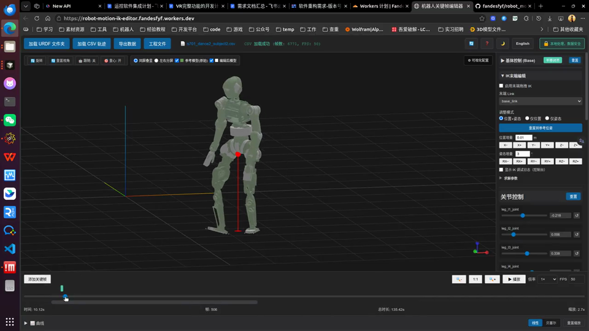
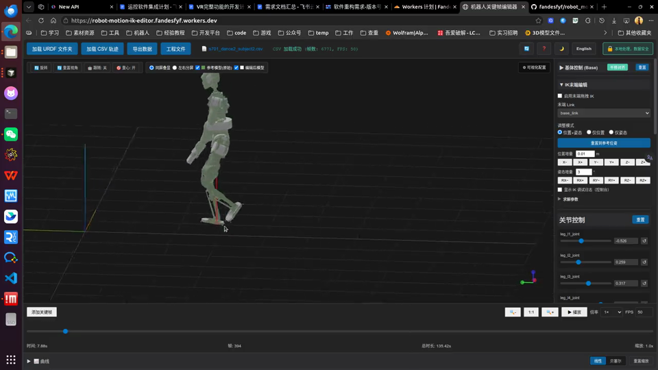

# 机器人关键帧编辑器

基于 Web 的机器人运动轨迹编辑工具，支持 URDF 模型加载、CSV 轨迹编辑、双视口对比、逆运动学（IK）末端编辑与工程状态管理。

**English:** [README.en.md](README.en.md)

## 在线体验

**[robot-motion-ik-editor.fandesfyf.workers.dev](https://robot-motion-ik-editor.fandesfyf.workers.dev/)**

## 功能演示

以下演示基于典型编辑流程录制。点击缩略图可在浏览器中播放完整视频（仓库路径：`docs/assets/demo/`）。

### IK 末端编辑

在三维视口中拖拽末端执行器，调整位姿并将编辑结果写入当前帧关键帧；支持求解参数在线配置。

[](docs/assets/demo/end-effector-ik-edit.mp4)

### 关节编辑

通过侧栏关节控制与曲线面板，对轨迹进行关节空间编辑与关键帧管理。

[](docs/assets/demo/joint-edit.mp4)

### 视口与可视化设置

配置 Ghost 参考模型、同屏叠显/左右分屏、播放倍率等可视化选项。

[](docs/assets/demo/viewport-settings.mp4)

## 隐私与安全

所有数据处理均在浏览器本地完成，不上传至服务器。

## 主要功能

### 轨迹与关键帧

- 基于 CSV 基线轨迹的残差关键帧编辑，支持线性与贝塞尔插值
- 关键帧复制、粘贴、删除与拖动改帧（保留绝对编辑内容）
- 快捷键：`Ctrl+C` / `Ctrl+V`、`Delete` / `Backspace`（右键菜单同步提示）

### 数据导入

- 支持将 URDF 资源目录或 CSV 轨迹文件拖入页面加载
- 自动解析子目录中的 mesh，兼容 `package://` 路径引用
- 支持 unitree 与 seed 两种 CSV 格式（自动单位转换）

### 三维视口

- 参考轨迹 Ghost 叠显或左右分屏对比，可选相机同步
- 视口工具栏：Ghost 显隐、透明度、播放倍率、布局切换
- 坐标轴指示器快速切换正交视角

### IK 末端编辑

- 基于 [closed-chain-ik](https://www.npmjs.com/package/closed-chain-ik) 的末端位姿拖拽求解
- 位置与姿态统一权重配置，参考四元数增量编辑
- 可选求解日志与运动学校验（见 `tests/`）

### 曲线与时间轴

- 按关节名称按需显示曲线；曲线面板图例标识当前编辑对象
- 时间轴滚轮缩放与平移；曲线与时间轴 X 轴视图双向同步
- 工程 FPS 可在线修改

### 其它

- 工程保存/加载与自动保存（Cookie + IndexedDB）
- 重心与支撑多边形可视化
- 中英文界面

## 相对原仓库的更新说明

本仓库在 [cyoahs/robot_motion_editor](https://github.com/cyoahs/robot_motion_editor) 基础上扩展，对比基线如下。

| 项目 | 说明 |
|------|------|
| 基线提交 | [`48ee549`](https://github.com/cyoahs/robot_motion_editor/commit/48ee549e25042c9d4859139ef4ddb03f7b332701)（2026-05-12） |
| 最近更新 | 2026-06-03 |
| 在线部署 | [robot-motion-ik-editor.fandesfyf.workers.dev](https://robot-motion-ik-editor.fandesfyf.workers.dev/) |

完整提交记录：

```bash
git log 48ee549e25042c9d4859139ef4ddb03f7b332701..HEAD --oneline
```

### 更新摘要（按日期）

| 日期 | 内容 |
|------|------|
| 2026-05-30 | IK 末端编辑与 `closed-chain-ik` 集成；视口叠显/分屏与 Ghost 模型；URDF/CSV 拖入导入 |
| 2026-05-31 | IK 双 Gizmo 与位置优先求解策略 |
| 2026-06-01 | 视口配置工具栏、播放倍率、时间轴缩放与可编辑 FPS |
| 2026-06-03 | IK 求解器重构与调参面板；关键帧剪贴板与快捷键；曲线按需绘制与图例；时间轴与曲线视图同步 |

### 新增与增强功能

| 类别 | 说明 |
|------|------|
| IK 末端编辑 | 三维手柄拖拽、关键帧自动写入、权重与迭代参数配置 |
| 视口 | Ghost 参考轨迹、叠显/分屏、可视化工具栏 |
| 数据导入 | URDF 目录与 CSV 拖放加载 |
| 关键帧 | 复制/粘贴/删除、拖动改帧、绝对位姿语义 |
| 时间轴 | 缩放、平移、与曲线面板联动 |
| 曲线 | 按关节显示、图例、性能优化 |

## 自动保存

- **localStorage**：轨迹、关键帧与界面状态
- **IndexedDB**：大型 mesh 资源
- URDF 未变更时仅增量保存轨迹与关键帧

## 快速开始

**环境要求：** Node.js 18+（推荐 20+），支持 WebGL 的现代浏览器。

```bash
npm install
npm run dev          # http://localhost:3000
npm run build
npm run preview
npm run test:ik-fk   # 见 DEVELOPMENT.md
```

- 开发说明：[DEVELOPMENT.md](DEVELOPMENT.md)
- 使用手册：[USAGE.md](USAGE.md)
- 视口与 IK 设计：[docs/REQUIREMENTS-viewport-ik.md](docs/REQUIREMENTS-viewport-ik.md)

## 使用概要

1. 加载 URDF（拖入文件夹或文件选择器）
2. 加载 CSV 轨迹（拖入或文件选择器）
3. 编辑关节、基座或 IK 末端，添加/更新关键帧
4. 可选：在曲线面板查看关节轨迹
5. 保存工程或导出 CSV

关键帧快捷键：`Ctrl+C` 复制，`Ctrl+V` 粘贴至播放头，`Delete` 删除。详见应用内「使用说明」与 [USAGE.md](USAGE.md)。

## 技术栈

| 组件 | 说明 |
|------|------|
| Vite | 构建与开发服务 |
| Three.js | 三维渲染 |
| urdf-loader | URDF 解析 |
| closed-chain-ik | 末端 IK 求解 |

## 项目结构

```
robot_motion_editor/
├── index.html
├── docs/
│   ├── assets/demo/              # 演示视频与封面
│   └── REQUIREMENTS-viewport-ik.md
├── tests/
├── DEVELOPMENT.md
├── USAGE.md
└── src/
    ├── main.js
    ├── viewportManager.js
    ├── viewportToolbar.js
    ├── timelineController.js
    ├── timelineCurveViewSync.js
    ├── curveEditor.js
    ├── trajectoryManager.js
    ├── fileDropHandler.js
    └── ik/                         # IK 求解与面板
```

## License

MIT
